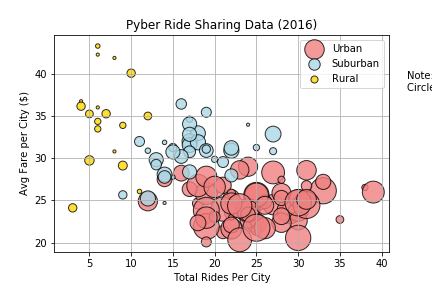
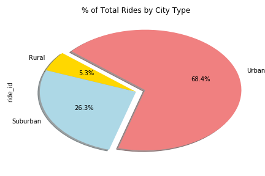
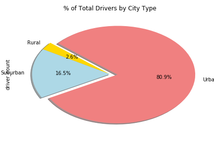

## Matplotlib The Power of Plots

# Analysis of ride sharing data 

The dataset contains information about every active driver and historic ride, including details like city, driver count, individual fares, and city type. Using this dataset I am building a Bubble Plot that showcases the relationship between four key variables:

Average Fare ($) Per City

Percentage of Total Number of Rides Per City

Percentage of Total Number of Drivers Per City

 #Using
  Pandas Library, Jupyter Notebook, Matplotlib library.
