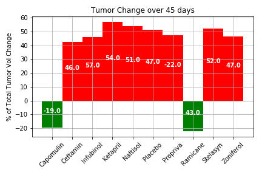
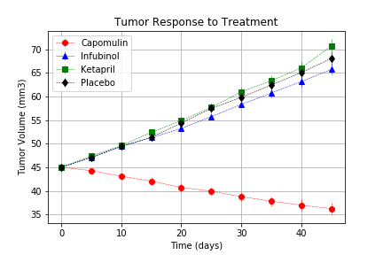
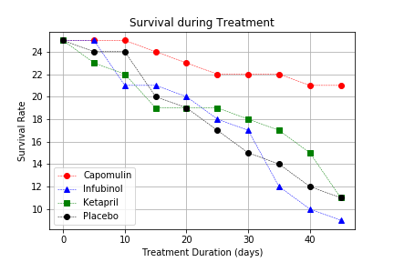
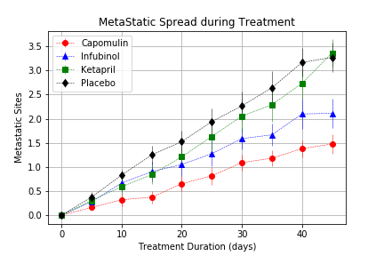

## Matplotlib The Power of Plots

# Analysis of Clinical trials 

The dataset is from a most recent animal study. In this study, 250 mice were treated through a variety of drug regimes over the course of 45 days. Their physiological responses were then monitored over the course of that time. The objective is to analyze the data to show how four treatments (Capomulin, Infubinol, Ketapril, and Placebo) compare.

Created a scatter plot that shows how the tumor volume changes over time for each treatment.

Created a scatter plot that shows how the number of metastatic (cancer spreading) sites changes over time for each treatment.

Created a scatter plot that shows the number of mice still alive through the course of treatment (Survival Rate).

Created a bar graph that compares the total percentage tumor volume change for each drug across the full 45 days.

 #Using
  Pandas Library, Jupyter Notebook, Matplotlib library.
